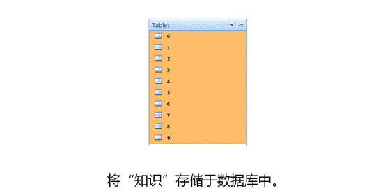

## 1.数字识别软件使用步骤

### 1.1 学习

1. 在画图区域用鼠标画出要学习的数字
2. 数字下拉列表选择对应的数字
3. 点击学习(Learn)按钮


4. 确认学习数字


5. 点击清除按钮清除画板，重复以上步骤多学习这个数字几次


### 1.2 识别

1. 在画板上画出要识别的数字
2. 点击识别按钮


### 1.3 注意事项

#### 1.3.1 重新学习

​	如果想删除数据库的学习记录，删除学习产生的数据库文件：`learnResult.db`，然后重新启动软件即可。若出现某个数字识别不准确，增加这个数字的学习次数，并确保每次学习的图像具有正确的特征值


#### 1.3.2 数字1的识别

​	为了能够识别画板上不同大小的数字，如下图，


​	所以设计算法求出画图区域的最大最小x，y坐标值，并进行九等分，为了使数字1具有易识别的特征值，建议绘制的数字倾斜一些。


 

## 2.数字识别的原理

### 2.1 学习过程

**第一步：特征抽取**

特征抽取算法：

​	将数字所在范围进行九宫格的分割，分割之后就可以计算每个九宫格里面有多少个像素，求出每个格中的像素数占整个数字像素的百分比，这样就可以得到一个九维的向量，它表示九维空间中的一个点，这样的一个点用模式识别的术语来说就是”特征向量“。


​	程序中的特征抽取函数是：`RecognizerAlgorithm::featureExtraction`，程序中的点（x1，y1）和（x2，y2）对应下图中的两个点，用于辅助计算绘制的点落在哪个区域


 

**第二步：特征向量存储（知识学习）**

​	用特征抽取算法就可以对每一个数字图像抽取出一个特征向量，将这些向量存入“知识库”，数据库中存放了“0-9”共十个数字的分类，一个分类下可以存放多个对应的特征向量。



 

### 2.2 识别过程

​	(1) 用学习时的方法抽取未知的特征向量，抽取出的向量是一个九维的向量，从解析几何的角度看他是九维空间中的一个点。

​	(2) 计算已知数字向量和未知数字特征向量的空间距离。求空间距离的公式：对于二维空间中的两点A(A1,A2) ,B(B1,B2)，距离d的计算公式是这样的：

```
d*d=(A1-B1)*(A1-B1)+(A2-B2)*(A2-B2)
```

 那么对于九维空间中的两点A(A1,A2，A3...A9) , B(B1,B2,B3...B9)，距离公式是这样的：

```
d*d=(A1-B1)*(A1-B1)+(A2-B2)*(A2-B2)+(A3-B3)*(A3-B3)+...+(A9-B9)*(A9-B9)
```

​	(3) 选择空间距离最近的特征向量所对应的数字作为结果输出

​	(4) 程序中对应的识别函数为：`RecognizerAlgorithm::get`

 

 