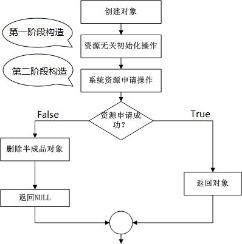

## 1. 数字识别软件使用步骤

[**下载可执行程序2.0**](./bin/Recognizer_2.0.exe)


### 1.1 学习

1. 在画图区域用鼠标画出要学习的数字
2. 数字下拉列表选择对应的数字
3. 点击学习(Learn)按钮


4. 确认学习数字


5. 点击清除按钮清除画板，重复以上步骤多学习这个数字几次


### 1.2 识别

1. 在画板上画出要识别的数字
2. 点击识别按钮


### 1.3 注意事项

#### 1.3.1 重新学习

​	如果想清除之前的学习经验，可以删除学习产生的数据库文件：`learnResult.db`，然后重新启动软件即可。若出现某个数字识别不准确，增加这个数字的学习次数，并确保每次学习的图像具有正确的特征值。


#### 1.3.2 数字1的识别

​	为了能够识别画板上不同大小的数字，如下图，


​	所以设计算法求出画图区域的最大最小x，y坐标值，并进行九等分，为了使数字1具有易识别的特征值，建议绘制的数字倾斜一些。


 

## 2. 数字识别的原理

### 2.1 学习过程

**第一步：特征抽取**

特征抽取算法：

​	将数字所在范围进行九宫格的分割，分割之后就可以计算每个九宫格里面有多少个像素，求出每个格中的像素数占整个数字像素的百分比，这样就可以得到一个九维的向量，它表示九维空间中的一个点，这样的一个点用模式识别的术语来说就是”特征向量“。


​	程序中的特征抽取函数是：`RecognizerAlgorithm::featureExtraction`，程序中的点（x1，y1）和（x2，y2）对应下图中的两个点，用于辅助计算绘制的点落在哪个区域


 

**第二步：特征向量存储（知识学习）**

​	用特征抽取算法就可以对每一个数字图像抽取出一个特征向量，将这些向量存入“知识库”，数据库中存放了“0-9”共十个数字的分类，一个分类下可以存放多个对应的特征向量。


 

### 2.2 识别过程

​	(1) 用学习时的方法抽取未知的特征向量，抽取出的向量是一个九维的向量，从解析几何的角度看他是九维空间中的一个点。

​	(2) 计算已知数字向量和未知数字特征向量的空间距离。求空间距离的公式：对于二维空间中的两点A(A1,A2) ,B(B1,B2)，距离d的计算公式是这样的：

>   $d^2 = (A1-B1)^2+(A2-B2)^2$

 那么对于九维空间中的两点A(A1,A2，A3...A9) , B(B1,B2,B3...B9)，距离公式是这样的：

>   $d^2 = (A1-B1)^2+(A2-B2)^2+(A3-B3)^2+...+(A9-B9)^2$

​	(3) 选择空间距离最近的特征向量所对应的数字作为结果输出

​	(4) 程序中对应的识别函数为：`RecognizerAlgorithm::get`

## 3. 数字识别软件设计

### 3.1 模块设计

#### 3.1.1 模块定义
**基本程序架构一般包括:**

-   用户界面模块（UI）  

> 接收用户输入及呈现数据  

-   业务逻辑模块（Business Logic）  


> 根据用户需求处理数据  

#### 3.1.2模块解耦
功能模块之间需要进行解耦  
> 核心思想：**强内聚，弱耦合**  
>
> 每个模块应该只实现单一的功能  
>
> 模块内部的子模块应该为整体的单一功能而存在  
>
> 模块之间通过约定好的接口进行交互  
#### 3.1.3用户界面与业务逻辑的交互
模块之间仅通过接口进行关联  
> 必然存在模块会使用接口  
>
> 必然存在模块实现对应的接口  

模块间的关系是单向依赖的  
> 避免模块间存在循环依赖的情况  
>
> 循环依赖是糟糕设计的标准之一  

 

### 3.2 数字识别应用程序的整体架构

 

### 3.3 数字识别中使用到的设计模式

#### 3.3.1 二阶构造模式

工程开发中的构造过程可分为：

-    资源无关的初始化操作


>   不可能出现异常情况的操作

-    需要使用系统资源的操作


>   可能出现异常情况，如：内存申请，访问文件


二阶构造流程：

 

  数字识别类（Recognizer）、界面类 (RecognizerUI )、均使用二阶构造模式，防止异常的产生,下面是Recognizer类的中的二阶构造部分。

```c++
/* 第一阶段，内部可实现一些与资源无关的操作 */
Recognizer::Recognizer()
{
}

/* 第二阶段，所有可能发生异常的操作都可放在这里执行 */
bool Recognizer::construct()
{
    m_ui = RecognizerUI::NewInstance();

    if( m_ui != NULL )
    {
        m_ui->setRecognizer(&m_algorithm);
    }

    return (m_ui != NULL);
}
/* 使用二阶构造模式 */
Recognizer* Recognizer::NewInstance()
{
    Recognizer* ret = new Recognizer();

    if( (ret == NULL) || !ret->construct() )
    {
        /* 构造失败或者第二阶段失败，就销毁半成品对象 */
        delete ret;
        ret = NULL;
    }

    /* 否则返回已经生成完成的对象指针 */
    return ret;
}
```

#### 3.3.2 策略者模式

​	策略模式用于算法的自由切换和扩展，对应于解决某一问题的一个算法族，允许用户从该算法族中任意选择一个算法解决问题。为了方便算法族中的不同算法在使用中具有一致性，在策略模式中会提供一个抽象层来声明公共接口。

##### 	数字识别中的策略者模式

 

-   `Recognizer`：是使用算法的角色，可以在解决不同具体的问题时实例化不同的具体识别算法类对象
-   `IRecognizer`：声明算法的方法，抽象层的设计使Recognizer类可以无差别的调用不同的具体算法
-   `RecognizerAlgorithmA`和`RecognizerAlgorithmB`：实现具体的一种算法，当前项目中只使用了一种算法


##### 使用策略者模式的优点

​	系统需要在一个算法族中动态选择一种算法，可以将这些算法封装到多个具体算法类中，这些算法类都有共同的基类，即可以通过一个统一的接口调用任意一个算法，客户端可以使用任意一个算法，当前使用“向量的空间距离值”算法，之后也可以扩展KNN等识别算法，而只需要很小改动即可。 

##  4.数字识别数据库存储设计

### 4.1数据库类

-   选用Sqlite数据库，并将数据库相关的操作封装成一个单例类，数据库类的UML图如下：


 

-   数据库类封装了数据项的添加，查询，数量获取，表清空操作。

### 4.2 数据库类的使用

(1).算法类构造的时候，会从数据库中获取所有的记录项，并计算平均特征值，存放到RecognizerAlgorithm::m_averageChara数组中

```c++
RecognizerAlgorithm::RecognizerAlgorithm()
{
    /* 从数据库中初始化平均特征值 */
    for(int i=0;i<10;i++)
    {
        getAverageChara(i, m_averageChara[i]);
    }
}
```

 (2).为了防止数据库中的表项过多，一次全部加载到内存中会占用太多的内存，采用分段加载的方式，实现函数为`RecognizerAlgorithm::getAverageChara`

```c++
bool RecognizerAlgorithm::getAverageChara(int number, Characteristic &averageChara)
{
    QList<Characteristic > list;
    int startRow = 0;
    int countSum = 0;
    long long characterSumBuf[9] = {0};
    while(true)
    {
        list.clear();
        SqliteHandler::getInstance()->getItems(number, startRow, ROW_NUMBER, list);
        for(int j = 0; j<list.size(); j++)
        {
            for(int i=0;i<9;i++)
            {
                characterSumBuf[i] += list[j].array[i];
            }
        }
        countSum += list.size();
        startRow += list.size();/*更新表读取起始位置*/

        /* 读到最后一页，不足ROW_NUMBER个，读完退出 */
        if(ROW_NUMBER != list.size())
        {
            break;
        }
    }
    if(0 != countSum)
    {
        for(int i=0;i<9;i++)
        {
            averageChara.array[i] = characterSumBuf[i]/countSum;
        }
    }
    return true;
}
```

 (3).`RecognizerAlgorithm::set`对数据库的操作

调用`SqliteHandler::addItem`添加一个特征值，添加特征值之后不会重新获取数据库中的所有项并重新计算，而是在现用的特征值的基础上进行计算，大大减少了计算量。

​	以苹果为例， 已知countLast的苹果的平均重量是 averageLast，现在添加一个重量为newRingoWeight的苹果，新的countLast + 1个苹果的平均值avarageNow为：

$avarageNow$ = $ (countLast  *  averageLast + newRingoWeight) \over (countLast + 1)$

```c++
bool RecognizerAlgorithm::set(const int number, const QList<QPoint>& pointsList)
{
    //...
    for(int j=0; j<9; j++)
    {
        m_averageChara[number].array[j] = 
            (m_averageChara[number].array[j] * lastCount + chara.array[j])/(lastCount + 1);
    }
    //...
} 
```

(4).`RecognizerAlgorithm::get` 不用读取数据库，直接根据`RecognizerAlgorithm::m_averageChara`数组中的最新特征平均值计算 最小特征距离。
